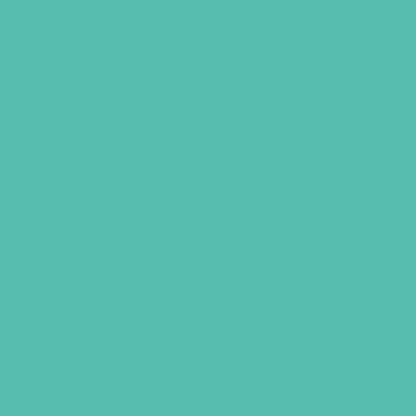
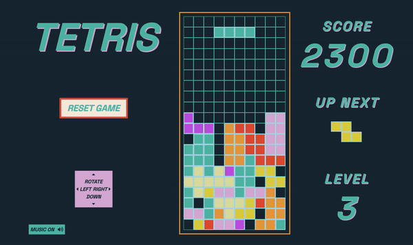

<!--  -->



# General Assembly Project 1: Tetris

## Project Brief
This project was set 3 weeks into the Software Engineering Immersive course. The goal was to create a fully functioning browser-based game using vanilla Javascript and DOM manipulation.

## Timeframe
7 days

## Technologies Used
* HTML5
* JavaScript (ES6)
* CSS3
* HTML5 audio
* Git / GitHub
* Google Fonts

## Deployed Version
https://rickyc000.github.io/sei-project-1/ 



## Gameplay
Tetris is a single-player video-game first developed by Russian software engineer Alexey Pajitnov in 1984.

Players build their score by moving differently shaped pieces (known as Tetrimonoes) as they descend into specific places on the grid in order to complete a full row.

As more rows are completed, the difficulty level increases as Tetrimonoes fall at a faster rate. Points are awarded dependant on the difficulty level and also for completing multiple rows at once.

The game ends when the playing field is full and the Tetrimonoes are no longer able to fall.

## Controls
* Click 'Start Game' to begin
* Up (  ) rotates the falling Tetrimono
* Left (  ) moves the Tetrimono left
* Right (  ) moves the Tetrimono right
* Down (  ) increases the speed of the falling Tetrimono
* Click 'Reset Game' to wipe your score and reset the grid
* Click 'Music On/Off' to start/stop the audio

## Process
### Creating the playing field grid
The first step was to mount the playing grid to the page using JavaScript. 

We'd been shown how to create a 10x10 grid using a simple for loop, but this needed to be tweaked in order to account for the Tetris playing grid.

I knew I wanted to label each cell with an X and a Y value in order to apply styling later on, so simply increasing the cell count on a for loop would not have been sufficient to achieve this.

By nesting a for loop within another for loop I was able to generate a grid containing 200 cells, each labelled with a class for their X and Y coordinates respectively. 

```
const width = 10
const height = 20

function createGrid() {
  for (let row = 1; row <= height; row++) {
    for (let column = 1; column <= width; column++) {
      const cell = document.createElement('div')
      cell.classList = `Y${row} X${column}`
      grid.appendChild(cell)
      cells.push(cell)
    }
  }
}

createGrid()
```

I repeated this process with some adjustments in order to create the 'Up Next' grid. 

### Adding the shapes
Cell positions for each Tetrimono were stored as objects in an array (see below) and randomly generated at the start of the game, and then every time the previous shape reached the playing field floor.

In researching the game I was also pleased to find out that alongside names like Hero, Rhode Island Z and Teewee, I shared a name with a couple of the Tetrimonoes!

```
{
  name: 'Orange Ricky',
  defaultPosition: [6, 14, 15, 16],
  upNextPosition: [8, 11, 12, 13],
  color: 'orange-ricky',
},
{ 
  name: 'Blue Ricky',
  defaultPosition: [3, 13, 14, 15],
  upNextPosition: [6, 11, 12, 13],
  color: 'blue-ricky',
}
```

### Controlling the movement
The cell positions for each Tetrimono determined whether a cell should have the class 'full', meaning occupied by a shape, and if so which colour it should be, provided in the above object.

All Tetrimono movements after the shape had been added to the grid were therefore iterations on the above cell coordinates.

A timer triggers the downward movement, the intervals increasing in rate as the player progresses through the difficulty levels.

```
let interval = 400 - levelTotal * 30
function startTimer() {
  timerId = setInterval(() => {
    interval = 400 - levelTotal * 30
    moveDownActiveTetrimono()
  }, interval)
}
```

Checks are carried out on each downward movement to determine whether the Tetrimono is either at the bottom of the grid, or about to collide with another occupied cell. Either scenario triggers the creation of a new 'active' Tetrimono.

Sidewards movements and rotations similarly need to consider whether a Tetrimono is either about to collide with another stationary shape or hit the edge of the grid.

At each stage, checks are also carried out identifying whether any rows have been completed, as below:
### 
```
function checkingForCompleteRows() {
  const rows = []
  const completeRows = []
  for (let rowNumber = 1; rowNumber <= 19; rowNumber++) {
    rows[rowNumber] = []
    rows[rowNumber].length = 0
    for (let cellNumber = rowNumber * 10; cellNumber <= rowNumber * 10 + 9; cellNumber++) {
      if (cells[cellNumber].classList.contains('square-full')) {
        rows[rowNumber].push(['square-full'])
      } else {
        return
      }
      if (rows[rowNumber].length === 10) {
        completeRows.push(rowNumber)
      } else {
        return
      }
    }
  }
  clearCompleteRows(completeRows)
  }
```

Upon each check, any completed rows are recorded in an array before being passed into a separate function: `clearCompleteRows`.

This function's role is to wipe all cells in each completed row of their `full` class. Each cell then inherits the classList, which also contains the cell colour information, from the cell directly above it and simultaneously adds to the users score.

## Reflection
### Challenges


### Key Learnings

* **JavaScript fundamentals**: This project enabled me to apply the topics explored in the first 3 weeks of the course in a practical way, using loops, conditional statements and various array methods achieve my objective.

* **Project planning:** 


## Credits
* General Assembly provided the starter code for a simple 10x10 grid which was adjusted to create the grid required for Tetris
* Music: 'Tachyon Frog' by CCL from Physically Sick 3 - a compilation raising money for Equality For Flatbush, an organization that has been fighting racist police abuse and gentrification since 2013. To support this project or find out more, head here: https://physicallysick3.bandcamp.com/album/physically-sick-3.


